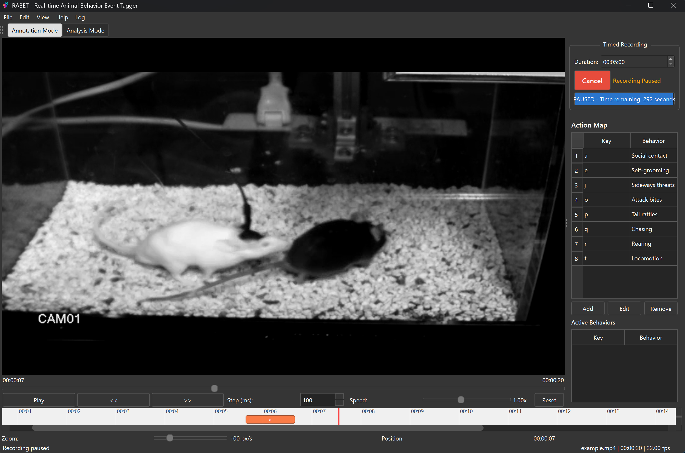

  
  <h1>RABET - Real-time Animal Behavior Event Tagger</h1>
  
A specialized desktop application for behavioral researchers to annotate animal behaviors in videos with precise timing

  
  
  

## 📋 Features

- 🎥 Video playback with frame-by-frame precision control
- ⌨️ Keyboard-based real-time annotation using configurable mappings
- 📊 Interactive timeline visualization of behavioral events
- ⏱️ Timed recording sessions with pause/resume capability
- 📈 Multi-file analysis for aggregate behavioral data
- 🔬 Project management for research organization

## 🚀 Getting Started

### Prerequisites
- Windows 10/11
- [VLC Media Player](https://www.videolan.org/vlc/) (Latest version)
  - VLC is required for video playback functionality
  - Make sure to install the 64-bit version

### Installation & Running
1. Download the latest release from the [Releases](https://github.com/yourusername/RABET/releases) page
2. Extract the ZIP file to a location of your choice
3. Run `RABET.exe` to start the application

No Python installation is required to run the distributed executable.

## 📺 Quick Start Guide

1. Open a video file using File → Open Video
2. Configure key mappings using the Action Map panel
3. Start a timed recording session using the Recording Control panel
4. Press mapped keys while watching the video to mark behaviors
5. Annotations will be automatically exported upon completion

## 📷 Screenshots

  

