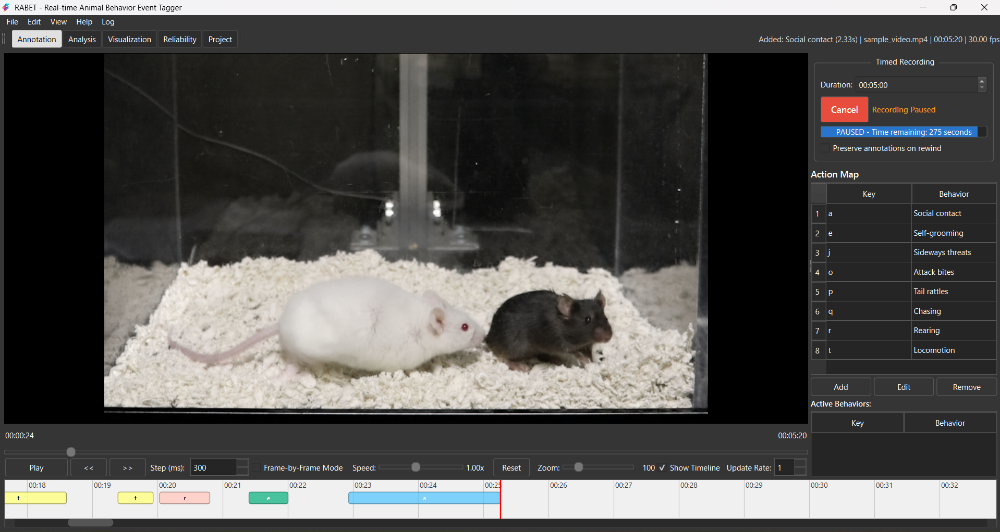

<div class="rabet-hero" markdown>

# RABET

### Real-time Animal Behavior Event Tagger

A self-contained desktop application for behavioural annotation of
animal video recordings — frame-accurate playback, keyboard-driven
tagging, multi-file CSV analysis, raster-plot visualisation, and
built-in inter-/intra-rater reliability assessment.

[Download for your platform :material-download:](https://doi.org/10.5281/zenodo.15313025){ .md-button .md-button--primary }
[Read the User Guide :material-book-open-page-variant:](USER_GUIDE.md){ .md-button }
[GitHub :material-github:](https://github.com/mi2e-K/RABET){ .md-button }

</div>

<p align="center" markdown>
  { width=900 }
  <br>
  *The Annotation view — video player, recording controls, action map, and colour-coded timeline.*
</p>

---

## Why RABET?

<div class="grid cards" markdown>

-   :material-video-outline:{ .lg .middle } &nbsp;**Frame-accurate playback**

    ---

    PyAV / FFmpeg-backed decoder. Single-frame stepping, instant
    seek, no external VLC or codec packs required.

-   :material-keyboard-outline:{ .lg .middle } &nbsp;**Keyboard-driven tagging**

    ---

    Configurable key → behaviour mapping. Press a key to start an
    event, release to end it. Monotonic time stamps are immune to
    NTP jumps.

-   :material-chart-timeline-variant:{ .lg .middle } &nbsp;**Interactive timeline**

    ---

    Colour-coded behaviour bars with auto-scrolling playhead.
    Click to select, `Delete` to remove, `Ctrl+Z` to undo.

-   :material-file-multiple-outline:{ .lg .middle } &nbsp;**Multi-file analysis**

    ---

    Aggregate annotation CSVs into per-session and per-interval
    summaries. Custom latency and total-time metrics. One-click
    export to Excel, JASP, R, or SPSS.

-   :material-chart-scatter-plot:{ .lg .middle } &nbsp;**Raster-plot visualisation**

    ---

    Cross-animal raster plots with per-behaviour colour
    customisation, grid lines, and PNG / SVG / PDF export.

-   :material-scale-balance:{ .lg .middle } &nbsp;**Reliability built-in**

    ---

    Inter- and intra-rater agreement with **ICC(2,1)**,
    **Cohen's κ**, and **Krippendorff's α**. Cross-validated
    against an R reference script using `psych::ICC`.

</div>

---

## Get started in minutes

<div class="grid" markdown>

=== ":material-microsoft-windows: Windows"

    ```text
    1. Download RABET-Windows-1.3.5-Setup.zip from Zenodo
    2. Run the installer
    3. Launch RABET from the Start Menu
    ```

=== ":material-apple: macOS (Apple Silicon)"

    ```text
    1. Download RABET-macOS-arm64-1.3.5.dmg from Zenodo
    2. Open the DMG and drag RABET.app into Applications
    3. First launch: right-click → Open
    ```

=== ":material-apple: macOS (Intel)"

    ```text
    1. Download RABET-macOS-x86_64-1.3.5.dmg from Zenodo
    2. Open the DMG and drag RABET.app into Applications
    3. First launch: right-click → Open
    ```

=== ":material-linux: Linux"

    ```bash
    chmod +x RABET-Linux-x86_64-1.3.5.AppImage
    ./RABET-Linux-x86_64-1.3.5.AppImage
    ```

</div>

!!! tip "Self-contained binary"
    No system-wide VLC, FFmpeg, Python, scipy, or R installation is
    needed. RABET bundles every runtime dependency it needs to play
    video, decode frames, and compute agreement metrics.

---

## Cite RABET

If RABET supports your research, please cite it.  Machine-readable
metadata lives in [`CITATION.cff`](https://github.com/mi2e-K/RABET/blob/main/CITATION.cff); a human-readable form is:

> Mitsui, K. (2026). *RABET — Real-time Animal Behavior Event Tagger*
> (Version 1.3.5). https://github.com/mi2e-K/RABET
> doi:[10.5281/zenodo.15313025](https://doi.org/10.5281/zenodo.15313025)

The DOI above is the **concept DOI** that always resolves to the
latest RABET release on Zenodo, so the citation stays valid as new
versions are published.

A tool paper describing RABET is in preparation.

---

## License

Released under the **MIT License** — see
[`LICENSE`](https://github.com/mi2e-K/RABET/blob/main/LICENSE) for the
full text.
